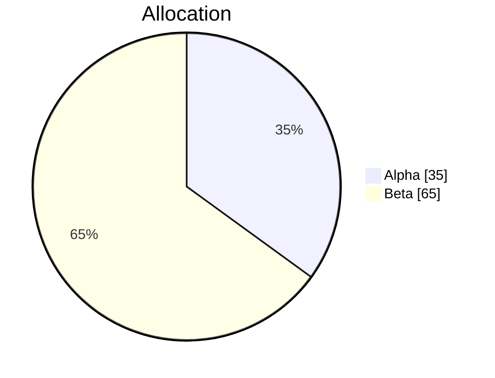
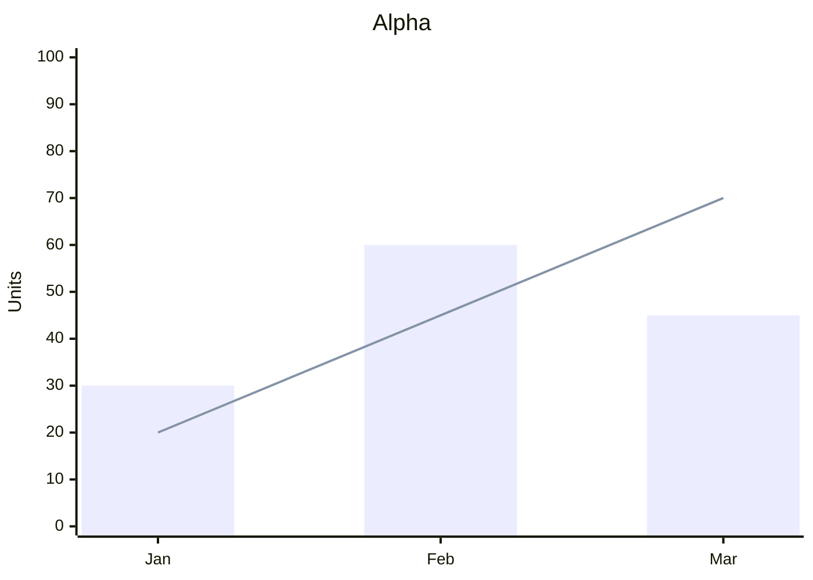
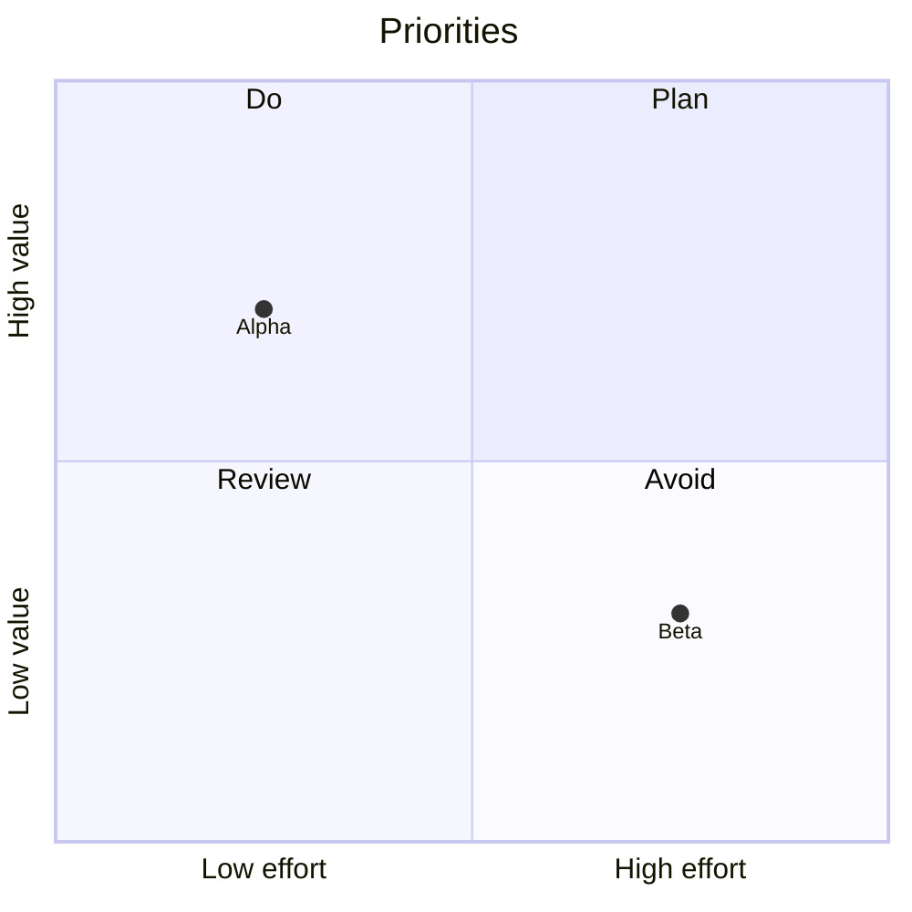
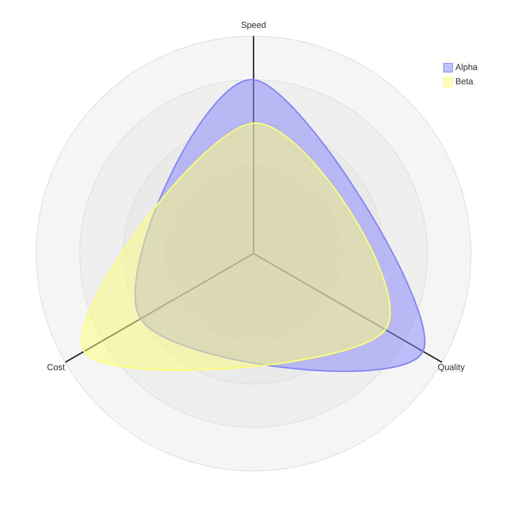
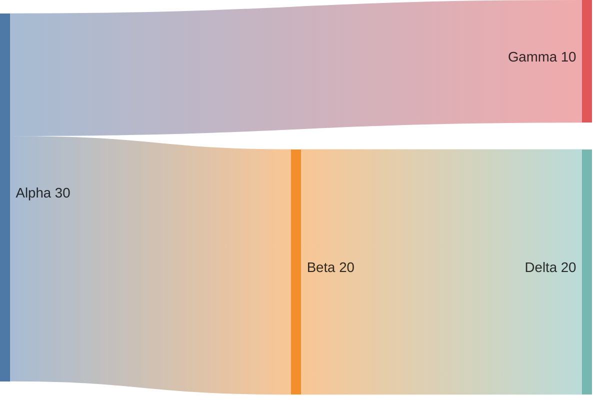
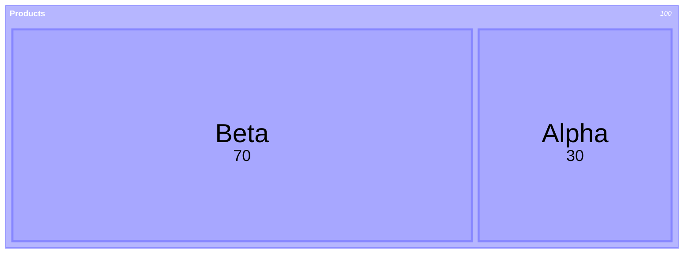
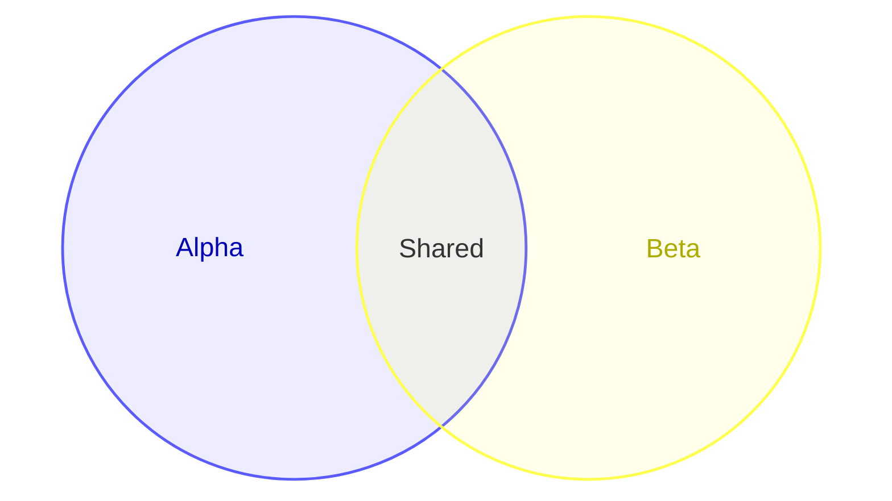
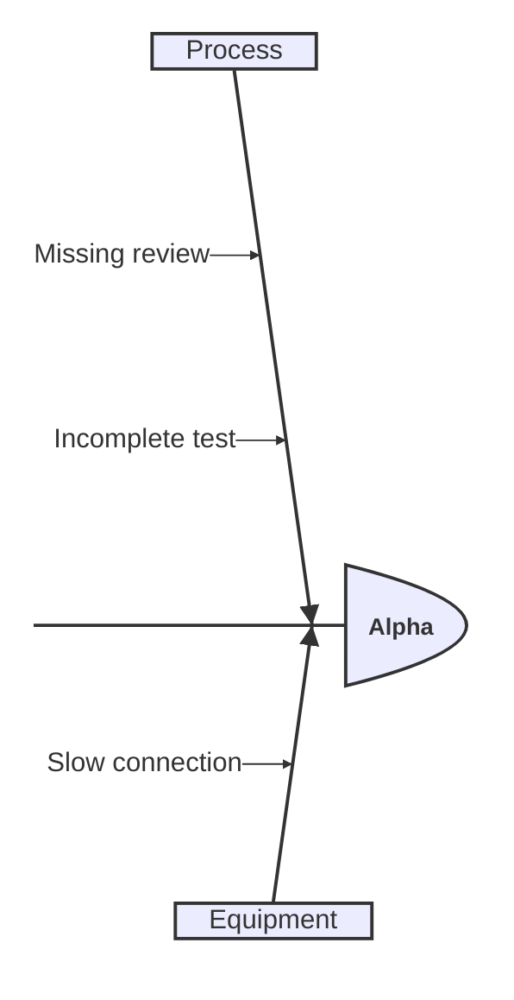

# Mermaid chart samples

Drop this file onto Whiteboard and choose Markdown. These small examples exercise
the built-in renderers; Alpha and Beta are sample labels, not required syntax.

## Pie

## XY chart

## Quadrant

## Radar

## Sankey

## Treemap

## Venn

## Ishikawa

