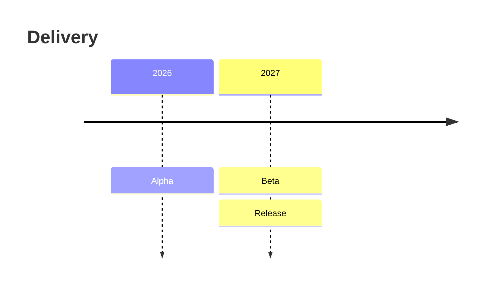
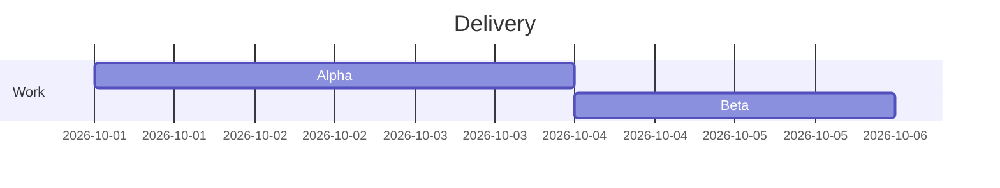
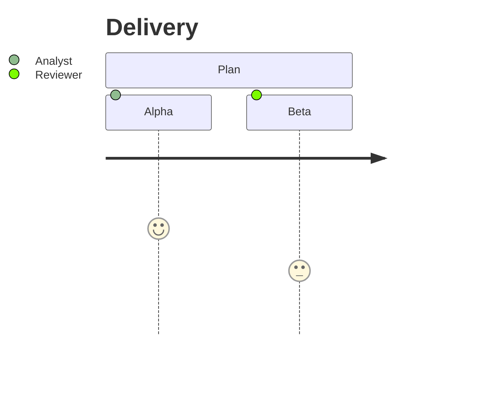
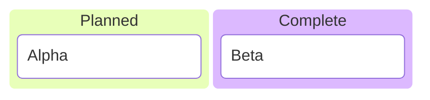
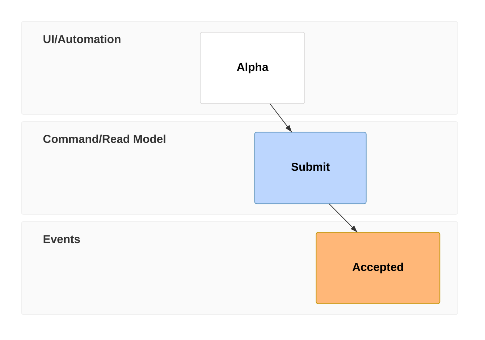

# Mermaid process samples

Drop this file onto Whiteboard and choose Markdown. Keywords ending in `-beta`
belong to experimental Mermaid families and can change in future library versions.

## Timeline



## Gantt



## User journey



## Kanban



## Swimlanes

```mermaid
swimlane-beta LR
  subgraph Team
    a[Alpha]
  end
  subgraph Review
    b[Beta]
  end
  a --> b
```

## AgentFlow

```mermaid
agentflow-beta TB
  flow review[Review]
    a[Alpha]@{ shape: input }
    b[Beta]@{ shape: task }
    c[Check]@{ shape: tool }
    a --> b --> c
  end
```

## Event modeling



## Cynefin

```mermaid
cynefin-beta
  title Decisions
  complex
    "Alpha"
  complicated
    "Analyze"
  clear
    "Repeat"
  chaotic
    "Stabilize"
  confusion
    "Investigate"
```

## Wardley

```mermaid
wardley-beta
title Dependencies
anchor Alpha [0.9, 0.6]
component Service [0.65, 0.5]
component Storage [0.3, 0.8]
Alpha -> Service
Service -> Storage
evolve Service 0.75
```
