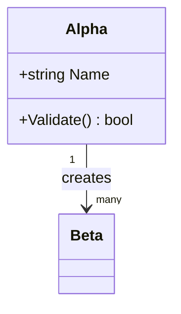
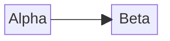
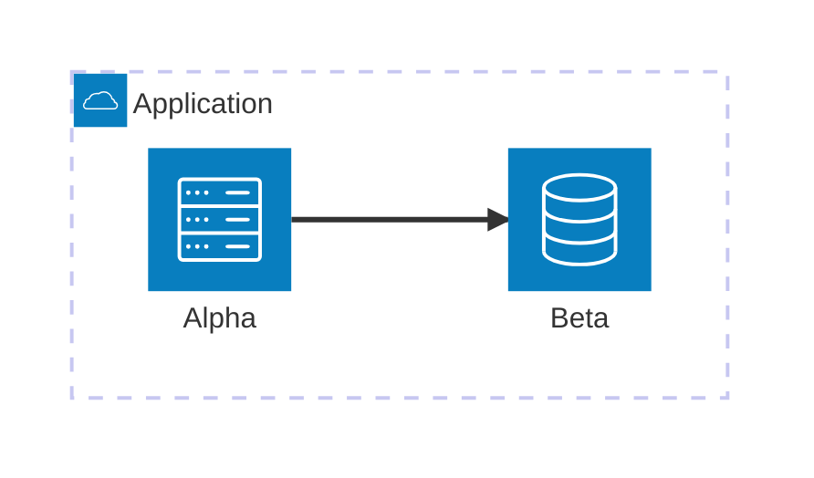
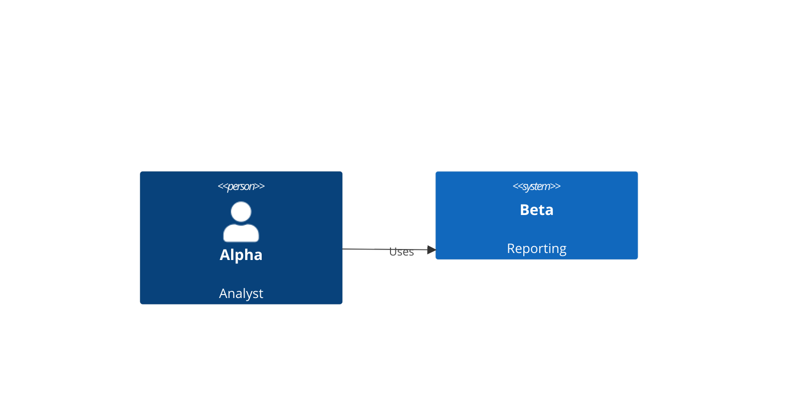
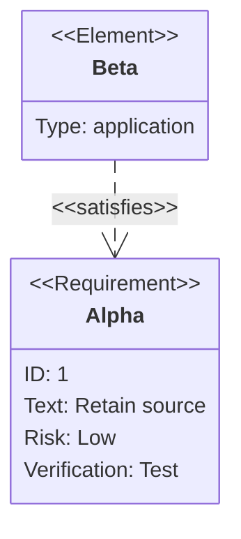
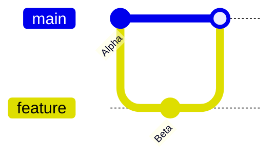
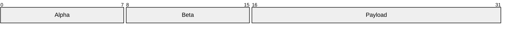
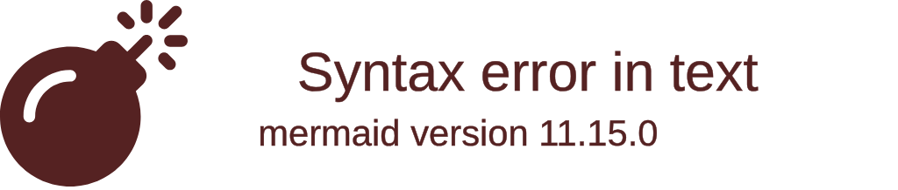

# Mermaid structure samples

Drop this file onto Whiteboard and choose Markdown. The final four examples are
different notations for one family: railroad diagrams.

## Class



## Block



## Architecture



## C4



## Use case

```mermaid
usecase-beta
  direction LR
  actor Analyst("Alpha")
  systemBoundary "Application"
    Review("Beta")
  end
  Analyst --> Review
```

## Requirement



## Git graph



## Packet



## Tree view



## Railroad

```mermaid
railroad-beta
entry = sequence(terminal("Alpha"), optional(nonterminal("tail"))) ;
tail = choice(terminal("Beta"), terminal("Gamma")) ;
```

## Railroad EBNF

```mermaid
railroad-ebnf-beta
entry = "Alpha" [ tail ] ;
tail = "Beta" | "Gamma" ;
```

## Railroad ABNF

```mermaid
railroad-abnf-beta
entry = "Alpha" [ tail ] ;
tail = "Beta" / "Gamma" ;
```

## Railroad PEG

```mermaid
railroad-peg-beta
entry <- "Alpha" tail? ;
tail <- "Beta" / "Gamma" ;
```
