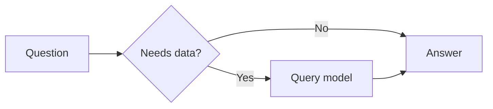
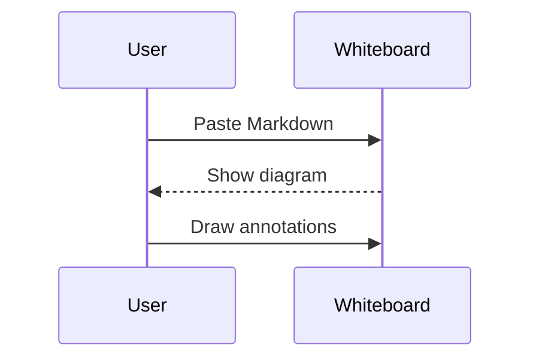
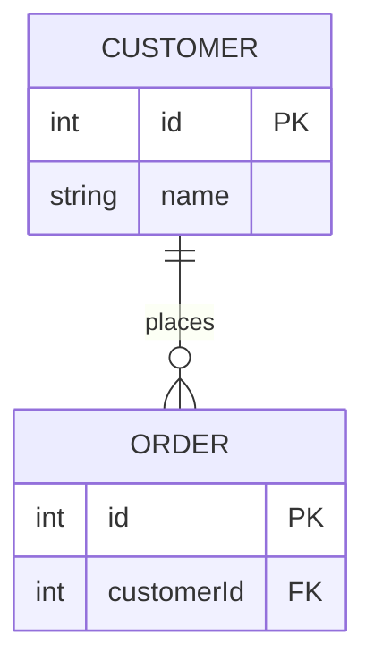
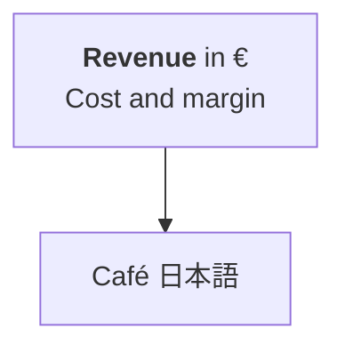

# Mermaid diagrams

These diagrams are rendered inside one Markdown container. Use F2 to edit the source
and Ctrl+Enter to show the result. You can draw over them with any drawing tool.

## Flowchart

| Input | Output |
| --- | --- |
| Mermaid source | A diagram you can annotate |
| Edited source | A new rendered diagram |

## Sequence diagram

## Entity relationships

## Multiline labels

