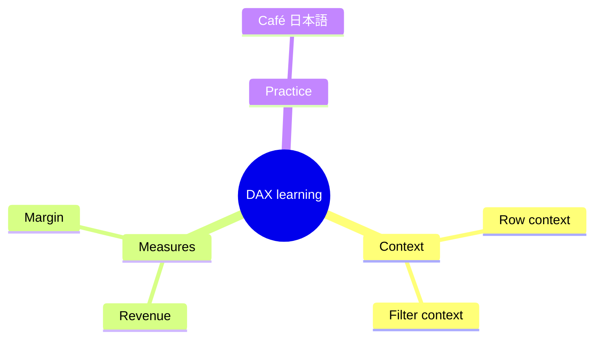
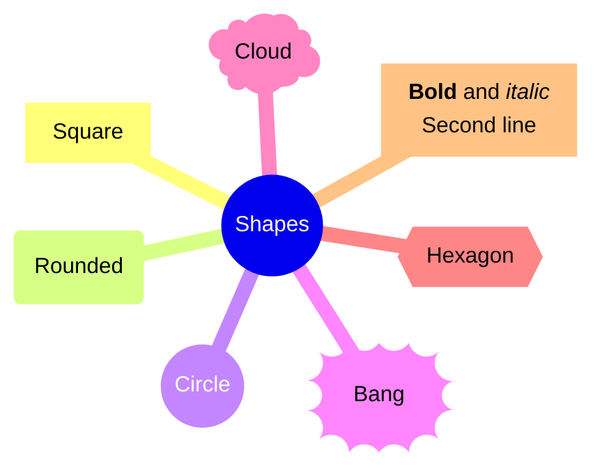
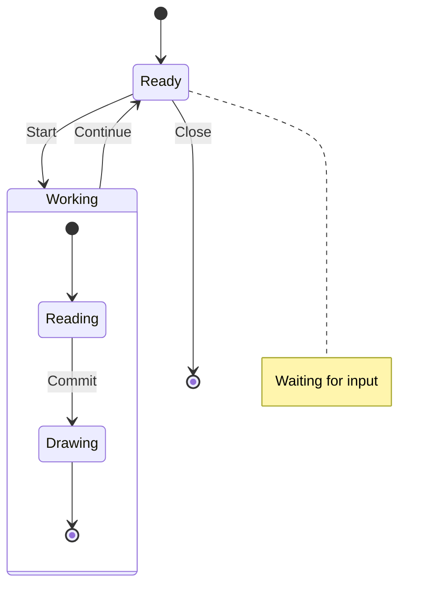
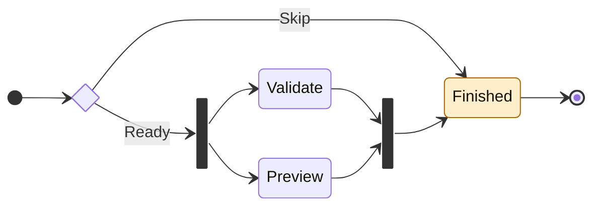
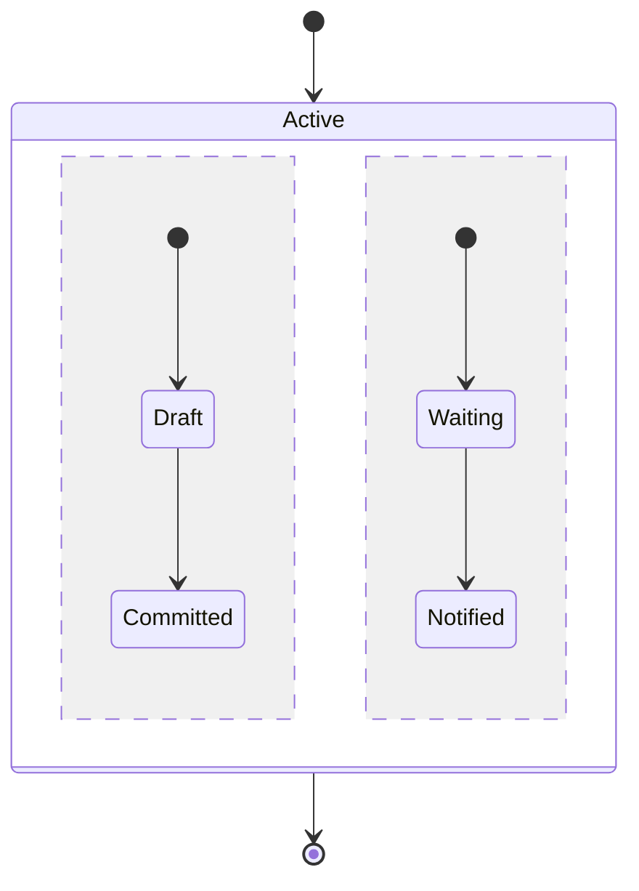

# Mind maps and state diagrams

Drop this file onto the board and choose Markdown if needed. Use F2 to edit and
Ctrl+Enter to show the result. Wait for rendering before adding annotations.

## Mind map

## Mind-map shapes and styled labels

## Nested states and notes

## Choices and parallel work

## Concurrent regions

